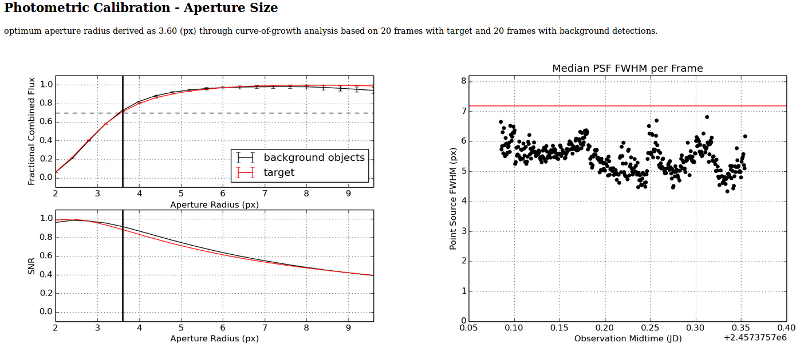

.. _diagnostics:

Diagnostics
===========

By default, PP creates extensive diagnostic output to provide the user
with a comfortable way to verify the quality of the derived
results. Focusing on human readability, the diagnostic output is in
the form of a HTML website that is accessible with any web browser.

Overview
--------

HTML Output
~~~~~~~~~~~

The diagnostic output for one specific data set can be accessed by
opening the ``diagnostics.html`` website that is created in the
respective data directory, e.g., using::

  firefox diagnostics.html

Data presented in this website are all stored in a sub-directory named
``.diagnostics/`` in the respective data directory (note that the dot
prefix makes this a hidden directory). 

In case PP has been run using the `all` option on a number of
underlying data directories, it will create ``diagnostics.html`` and
``.diagnostics/`` in every sub-directory containing data. In order to
provide easy access to the individual ``diagnostics.html`` file, PP
will also create a website named ``summary.html`` in the root
directory from which is has been called, linking to all created
``diagnostics.html`` websites.

LOG File
~~~~~~~~

All tasks performed by PP are documented using Python's logging
system. The LOG file is linked from the ``diagnostics.html`` files
(see top of the page). If you run PP using the `all` option, there is
one LOG file for all data sets (unfortunately, I haven't figured out
how to change the logging filename during runtime...).

The LOG file can be used to check proper performance of the
pipeline. Its main purpose is to simplify debbuging in case something
went wrong.

Diagnostics Details
-------------------

The following sections discuss the output of a successful pipeline run
in detail based on `this`_ example page.

Data Overview
~~~~~~~~~~~~~

The top of the diagnostics website lists the data directory, some
general information like the telescope/instrument combination, as well
as the total number of frames processed. The process LOG file (see
above) is linked here, too.

All the frames considered in the process are listed in a table,
providing information on the date and time, target, filter, airmass,
exposure time, and field of view. For each frame, a link is provided
that leads to an `image of that frame`_.

Registration
~~~~~~~~~~~~

The number of successfully registered frames (and the total number of
frames) is listed, as well as the astrometric catalog that was used in
the registration. Additional information on each frame is given on a
separate website that is linked from here.

The table on the `registration website`_ lists for each frame some
diagnostics from SCAMP, as well as an image with overplotted stars
from the respective astrometric catalog that was used. The image
enables a quick check of the reliability of the astrometric
solution. Furthermore, the quantifiers ``AS_CONTRAST`` and
``XY_CONTRAST`` indicate the goodness of the frame's rotation angle
and scale, and the frame's shift, respectively. ``RA_sig`` and
``DEC_sig`` provide a sense for positional uncertainties in arcsecs;
``Chi2_Reference`` and ``Chi2_Internal`` quantify the goodness of
fit. For additional information on these parameters, please refer to
the `SCAMP manual`_.

Photometric Calibration - Aperture Size
~~~~~~~~~~~~~~~~~~~~~~~~~~~~~~~~~~~~~~~

The optimum aperture size used by PP is determined using a
curve-of-growth analysis.

The **left plot** documents the curve-of-growth analysis. For a range
of aperture sizes, the flux and SNR of both the target (red line) and
the average over all background sources (black line) are
determined. Note that both the flux and the SNR are fractional
values - they are relative to the maximum flux (of either the target
or the background stars) or the maximum SNR. In order to obtain
reliable photometry, you want to include as much flux as possible but
at the same time keep the aperture as small as possible, in order to
minimize noise introduced by the background - this is reflected by the
SNR's peak (see, e.g, Howell's *Handbook of CCD Astronomy* for a
discussion). PP deliberately does not use the aperture radius that
provides the highest SNR. The optimum aperture radius is required to
include at least 70% of the both the target's and background sources'
flux - at the same time, the fractional flux difference between the
target and background sources has to be smaller than 5%. Both
conditions minimize the effect of potential trailing on the photometry
results. The optimum aperture radius is chosen as the smallest
aperture radius that meets the conditions listed above.

The **right plot** shows the median PSF full-width-half-max (FWHM)
based on all sources in the field as a function of time. The red line
indicates the optimum aperture diameter for comparison. The measured
FWHMs should be below the red line, meaning that the aperture diameter
is slightly larger than the image FWHM.  Variations in the FWHM can be
caused by seeing variations and or focus shifts. Note that in the case
of badly focused images, the measured FWHM is a bad indicator of the
real FWHM.

Photometric Calibration - Catalog Match
~~~~~~~~~~~~~~~~~~~~~~~~~~~~~~~~~~~~~~~

PP provides an automated photometric calibration based on a number of
different star catalogs. The calibration process is summarized on the
diagnostics website with a plot of the magnitude zeropoint as a
function of time:

.. figure:: phot_calibration.png
    :width: 600px
    :align: center
    :height: 355px
    :alt: photometric calibration
    :figclass: align-center

Variations in the magnitude zeropoint are due to changes in the
airmass, as well as due to transparency and seeing variations (see
FWHM plot above). In the case of the data shown here, thin cirrus led
to the clearly visible transparency variations.

In addition to the overview plot, PP provides `detailed information`_
on every single frame as shown below:

.. figure:: phot_calibration_single.png
    :width: 800px
    :align: center
    :height: 298px
    :alt: photometric calibration single frame
    :figclass: align-center

The top panel in the **left plot** shows the magnitude zeropoint (red
line) as a function of the number of background catalog stars used in
the calibration.  The number of background stars is reduced by
rejecting the most significant outlier at a time. The blue line
shows the reduced Chi2 of the remaining data points. Currently, 50% of
all background stars are rejected (vertical line) based on their
weighted residuals; weights account for photometric uncertainties and
catalog uncertainties. This representation shows that the magnitude
zeropoint does not depend on the number of background stars used in
the calibration. The bottom panel of this plot shows the magnitude
residuals of the background stars as a function of their brightness;
only those stars used in the final calibration are shown. The
rejection of 50% of all background stars is purely empirical and
usually leads to robust results.

The **right plot** shows the actual image overplotted with those stars
that were used in the final calibration. This map allows to verify
that calibration stars are evenly scattered across the whole field of
view.

Finally, all background stars used in the final calibration of each
frame are listed in a **table**, providing additional information. 

Photometry Results
~~~~~~~~~~~~~~~~~~

.. figure:: phot_results.png
    :width: 700px
    :align: center
    :height: 384px
    :alt: photometry results 
    :figclass: align-center

PP provides final photometry for the actual target(s) in the field, as
well as for one reasonably bright star that acts as a **comparison
star**. The comparison star photometry is derived using the exact same
calibrations and routines as the target, providing a good verification
of the whole process. Usually, the comparison star should have a flat
lightcurve that does not show significant variations. However, it
cannot be ruled out that the comparison star shows intrinsic
variability, or is subject to detector effects, leading to photometric
variability. The comparison star is required to be present in the
first and the last image of the sequence of images provided.

For each target, PP
provides a GIF animation and a lightcurve showing calibrated
photometry. The individual frames in the GIF show the expected target
position (green cross) and the actual aperture placement and size used
(red circle). The GIF allows for identifying target mismatches and
contaminations of the photometry aperture. A `dedicated photometry page`_
is featured for each target, allowing for a quick and easy
identification of corrupted frames. 

.. _image of that frame: http://134.114.156.170/photometrypipeline/example_7813/.diagnostics//mscience0300.fits.png
.. _registration website: http://134.114.156.170/photometrypipeline/example_7813/.diagnostics/registration.html
.. _detailed information: http://134.114.156.170/photometrypipeline/example_7813/.diagnostics/calibration.html
.. _SCAMP manual: https://www.astromatic.net/pubsvn/software/scamp/trunk/doc/scamp.pdf
.. _this: http://134.114.156.170/photometrypipeline/example_7813/diagnostics.html
.. _dedicated photometry page: http://134.114.156.170/photometrypipeline/example_7813/.diagnostics/7813_results.html
